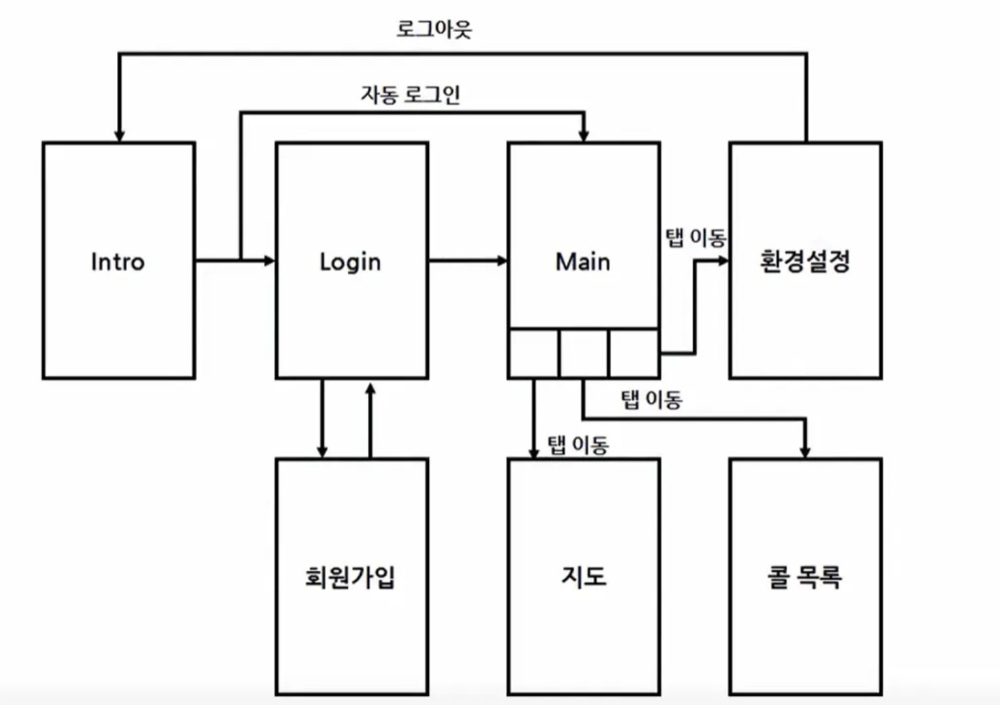

# 🚖 택시 호출 앱

## 📢 소개
택시 호출 앱은 사용자가 출발지와 목적지를 입력하여 서버에 배차 요청을 보내고, 서버에서 택시를 배차해주는 기능을 제공하는 애플리케이션입니다.

---

## 🎯 핵심 기능

### 🗺 지도
- 실시간 지도 제공
- 출발지 및 도착지 설정 가능

### 📋 콜 목록
- 사용자가 호출한 택시의 상태 확인 가능

---

## 👥 다중 사용자 지원

### 🔐 회원가입
- 사용자가 자신의 식별자(ID)를 등록하는 페이지 제공

### 🔑 로그인
- 사용자가 자신의 계정으로 인증 후 서비스 이용 가능

---

## ⚙ 일반 기능

### ⚙ 환경 설정
- 로그아웃 및 기타 설정 기능 제공

### 🚀 인트로
- 앱의 초기화 진행
- 로그인 과정 스킵 여부 설정 가능

---

## 🗺 네비게이션 구성도
